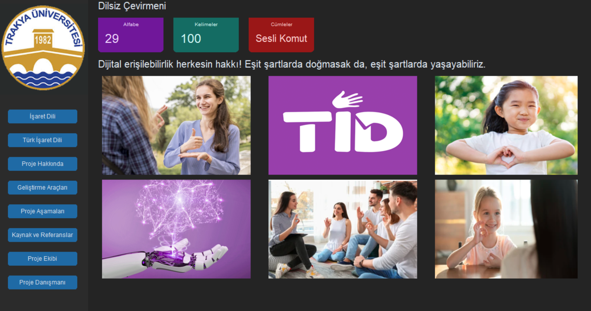

# Turkish-Sign-Language

## **Trakya Üniversitesi Bitirme Projesi**

Türk İşaret Dili algılama sistemi oluşturularak **Dilsiz Çevirmeni** adlı proje yapılmıştır.

## **Gereksinimler**
### Python Versiyonu
Python 3.8.10
### Kütüphaneler
#### 1.Opencv
```
pip install opencv-python
```
#### 2.Cvzone
```
pip install cvzone
```
#### 3.Subprocess
```
pip install subprocess32
```
#### 4.CustomTkinter
```
pip install customtkinter
```
#### 5.PIL
```
pip install Pillow-PIL
```
#### 6.Mediapipe
```
pip install mediapipe 
pip install --default-timeout=10000 mediapipe
```
#### 7.Speech Recognition
```
pip install SpeechRecognition
```


## **Model**
### Teachable Machine
Teachable Machine ile makine öğrenmesi kullanılarak h5 ve txt uzantılı dosyalar elde edildi. Çekilen fotoğrafların eğitilmesiyle elde edilen bu fotoğrafla veri seti oluşturuldu. Her kelime için yaklaşık 200 fotoğraf çekildi. Toplam yaklaşık 22500 fotoğraf ile 110 kelimelik veri seti oluşturuldu.


## **Arayüz Tasarımı**

